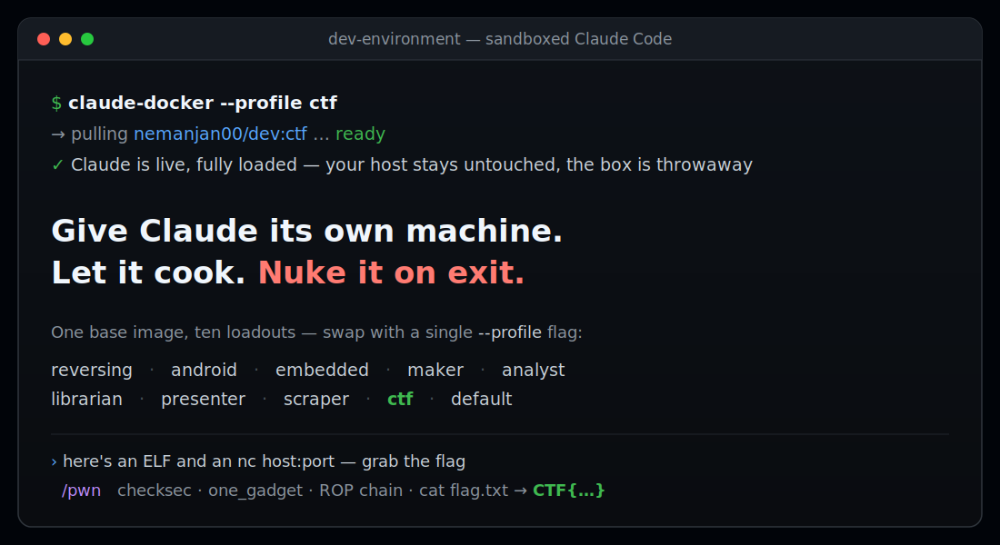

<div align="center">

# 🧪 dev-environment

### Give Claude its own machine. Let it cook. Nuke it on exit.

A **zero-config Docker sandbox** that boots straight into Claude Code —
pre-loaded with the exact toolchain your build needs, so you just vibe and ship.

[](https://github.com/nemanjan00/dev-environment/actions/workflows/build.yml)
[](https://hub.docker.com/r/nemanjan00/dev)
[](https://hub.docker.com/r/nemanjan00/dev)


**[Get cooking](#get-cooking)** · **[Why it slaps](#why-it-slaps)** · **[Loadouts](#profiles)** · **[Lock it in a VM](#vm-isolation)**



<sub>Neovim + LSP, tmux and zsh under the hood — see it [below](#run-it).</sub>

</div>

You know the move: let the agent run wild and *actually* get stuff done — but
not on your real machine. So give it its own. One command drops Claude into a
disposable container with `--dangerously-skip-permissions` fully on, a real IDE
under the hood (Neovim + LSP, tmux, zsh), and a **profile** that's already got
the entire toolkit for what you're building. Laptop stays pristine. Box gets
nuked on exit. You just talk.

## Get cooking

No build step, no setup ritual — install the wrappers once, then they pull
prebuilt images from Docker Hub on demand.

**Install** — clone to `~/.dev` and drop the wrappers on your `PATH`:

```bash
git clone https://github.com/nemanjan00/dev-environment ~/.dev
export PATH=$PATH:~/.dev/bin

echo "export PATH=\$PATH:$HOME/.dev/bin" >> ~/.zshrc
echo "export PATH=\$PATH:$HOME/.dev/bin" >> ~/.bashrc
```

**Run** — from any project directory:

```bash
claude login                    # once (or export ANTHROPIC_API_KEY=sk-...)

claude-docker                   # sandboxed Claude, dropped into your project
claude-docker --profile ctf     # ...packing a full binary-exploitation kit
```

Your project's mounted, your auth + git identity tag along, and Claude is live
in a throwaway box. Close it and it's gone.

> The wrappers **self-update** on launch (`git pull --ff-only` on `~/.dev`) so
> you always run the latest profiles and tooling — set `DEV_NO_UPDATE=1` to
> skip it.

## Why it slaps

- 🧰 **Loadouts, not setup.** Ten ready-made [profiles](#profiles) —
  `reversing`, `android`, `embedded`, `maker`, `analyst`, `librarian`,
  `presenter`, `scraper`, `ctf`, or plain `default`. Each stacks on one shared
  base, so swapping toolchains is a single `--profile` flag, not an afternoon.
- 🔒 **Send it — safely.** Claude runs unleashed *because* it's sandboxed; your
  host never feels it. Want it spinning up its own containers too?
  [`claude-vm`](#vm-isolation) wraps the whole thing in a throwaway VM.
- 🧠 **The box explains itself.** Every image ships a `/work/CLAUDE.md` and each
  profile appends its own playbook — some even auto-load Claude **skills** (the
  `ctf` profile hands Claude a ready-to-go `/pwn` workflow). Less prompting,
  more shipping.
- ⚡ **Zero-config, zero residue.** `claude login` once and the wrapper handles
  auth, config, and git. No toolchains pollute your machine, and the container
  itself is `--rm`'d on exit — the only host writes are your project and
  Claude's own config (so sessions and memory carry over).
- 🖥️ **Slaps without Claude too.** It's a legit portable IDE — Neovim + LSP,
  tmux, zsh, asdf Node/Python — even with the AI switched off.

## How it works

Three moving parts, zero ceremony:

1. **`claude-docker`** runs the image, mounts your current directory at
   `/work/project`, and copies in your Claude auth + git config. It launches
   `claude --dangerously-skip-permissions` inside tmux — pulling the latest
   image first, so you're always current.
2. **The image** is Arch-based: a shared `base` layer (Neovim, tmux, zsh, asdf
   Node/Python, Claude Code) plus a thin **profile** layer that adds the
   domain tools. Each profile also appends its own docs to `/work/CLAUDE.md`,
   so Claude knows what's installed and how to drive it.
3. **Nothing leaks.** No toolchains land on your host, and the container is
   `--rm`'d on exit — the only things written back are your project and Claude's
   own config dir (so your sessions and memory persist). Need harder isolation —
   say, Docker-in-Docker — `claude-vm` runs the same image inside an
   ephemeral Vagrant/libvirt VM that's destroyed on exit.

## Table of contents

<!-- vim-markdown-toc GFM -->

* [Get cooking](#get-cooking)
* [Why it slaps](#why-it-slaps)
* [How it works](#how-it-works)
* [Build it](#build-it)
* [Profiles](#profiles)
* [Run it](#run-it)
* [Opening project inside of it](#opening-project-inside-of-it)
* [Claude Code](#claude-code)
  * [Authentication](#authentication)
  * [What gets mounted](#what-gets-mounted)
  * [Manual Docker usage](#manual-docker-usage)
* [VM isolation](#vm-isolation)
* [Components](#components)
* [Supported languages](#supported-languages)
* [Author](#author)

<!-- vim-markdown-toc -->

## Build it

```bash
# Build base image
docker build -t nemanjan00/dev:base .

# Build a profile (default, reversing, etc.)
docker build -t nemanjan00/dev:default profiles/default/
docker build -t nemanjan00/dev:reversing profiles/reversing/
docker build -t nemanjan00/dev:embedded profiles/embedded/
docker build -t nemanjan00/dev:android profiles/android/
docker build -t nemanjan00/dev:maker profiles/maker/
docker build -t nemanjan00/dev:analyst profiles/analyst/
docker build -t nemanjan00/dev:librarian profiles/librarian/
docker build -t nemanjan00/dev:presenter profiles/presenter/
docker build -t nemanjan00/dev:scraper profiles/scraper/
docker build -t nemanjan00/dev:ctf profiles/ctf/

# With custom UID/GID (to match your host user) — apply to the base image
docker build --build-arg UID=$(id -u) --build-arg GID=$(id -g) -t nemanjan00/dev:base .
```

## Profiles

Think of a profile as a **loadout**. A shared `nemanjan00/dev:base` layer carries the common kit (zsh, Neovim, tmux, Node.js, Python, Claude Code); each profile stacks the domain tools on top. Because they share that base, switching loadout is one `--profile` flag and a small incremental pull — never a fresh multi-gigabyte download.

| Profile | Tag | Description |
|---------|-----|-------------|
| `default` | `nemanjan00/dev:default` | Base environment, no extras |
| `reversing` | `nemanjan00/dev:reversing` | Reverse engineering & forensics: radare2, r2ghidra, r2mcp, jadx, binwalk, apktool, volatility3, unicorn, keystone, magika, wireshark-cli, foremost |
| `embedded` | `nemanjan00/dev:embedded` | Embedded development: arm-none-eabi toolchain, platformio, avrdude, esptool, openocd, stlink, sigrok-cli, flashrom |
| `android` | `nemanjan00/dev:android` | Android / LineageOS builds: repo, git-lfs, JDK 17/11, android-tools, ccache, multilib libs, AOSP host toolchain |
| `maker` | `nemanjan00/dev:maker` | Physical-world maker: OpenSCAD for 3D-printable parts, bun + pre-installed tscircuit CLI for PCB design |
| `analyst` | `nemanjan00/dev:analyst` | Data / infra analyst (extends `reversing`): aws-cli, s3cmd, rclone, psql, mariadb, sqlite, duckdb, valkey-cli, rabbitmq admin, lnav, httpie, protoc, dig, ffmpeg |
| `librarian` | `nemanjan00/dev:librarian` | Document & ebook reading: pandoc, poppler (pdftotext), mupdf-tools, qpdf, pdfgrep, catdoc, djvulibre, unrtf, tesseract OCR, glow, w3m |
| `presenter` | `nemanjan00/dev:presenter` | Slide decks from Markdown via pandoc → beamer → xelatex: pandoc-cli, texlive (xetex, latexextra, fontsextra, pictures), fontconfig, Hack Nerd Font |
| `scraper` | `nemanjan00/dev:scraper` | Web scraping against anti-bot sites: CloakBrowser (stealth Chromium, Playwright/Puppeteer drop-in), Xvfb for headed mode, Chromium runtime libs, full font set |
| `ctf` | `nemanjan00/dev:ctf` | Binary exploitation / CTF (extends `reversing`): pwntools, GEF, ROPgadget, one_gadget, seccomp-tools, patchelf — plus an auto-loaded `pwn` exploitation skill |

To use a profile with the CLI scripts:

```bash
claude-docker --profile reversing

claude-vm --profile reversing
```

### Creating a new profile

Add a directory under `profiles/` with a `Dockerfile` that extends the base image:

```dockerfile
FROM nemanjan00/dev:base

USER 0
RUN pacman -Syu --noconfirm your-packages-here
USER 1000
```

CI builds and pushes every profile from `.github/workflows/build.yml`: base-derived profiles go in the build matrix, while a profile that extends another profile gets its own job chained with `needs:` (see `ctf`/`analyst`). Add your profile there so it ships.

If the profile needs extra bind mounts or env vars at runtime (e.g. a persistent ccache for Android builds), add an executable `docker-args.sh` in the profile directory. `claude-docker` runs it when the profile is selected and appends its stdout to the `docker run` arguments:

```bash
#!/bin/bash
# profiles/myprofile/docker-args.sh
mkdir -p "$HOME/.cache/myprofile"
echo "-v $HOME/.cache/myprofile:/work/.cache/myprofile"
```

## Run it

Skip the wrapper and you've still got a self-contained IDE — Neovim, tmux, and
zsh in a throwaway container:

```bash
docker run -ti nemanjan00/dev:default
```


## Opening project inside of it

Mount your code at `/work/project` and drop straight into a tmux session on it:

```bash
docker run -ti -eTERM=xterm-256color -v$(pwd):/work/project nemanjan00/dev:default zsh -ic "cd project ; tmux"
```

## Claude Code

Claude Code is pre-installed. The quickest way to get started is with the CLI scripts:

```bash
# Direct Docker — simple, no VM overhead
claude-docker

# VM-isolated — Claude gets its own Docker daemon, fully sandboxed
claude-vm
```

Both scripts auto-detect and mount `~/.claude.json` (OAuth), `~/.claude/` (config), and `~/.gitconfig` into the container. Claude runs with `--dangerously-skip-permissions` since the environment is sandboxed.

### Authentication

```bash
# API key (works with both scripts)
ANTHROPIC_API_KEY=sk-... claude-docker

# OAuth — just run `claude login` on the host first, then:
claude-docker  # ~/.claude.json is mounted automatically
```

### What gets mounted

| Host path | Container path | Purpose |
|-----------|---------------|---------|
| `~/.claude.json` | `/work/.claude.json` | OAuth credentials (from `claude login`) |
| `~/.claude` | `/work/.claude` | Full Claude config (settings, memory, CLAUDE.md) |
| `~/.gitconfig` | `/work/.gitconfig` | Git identity and settings (read-only) |

The container ships with a `/work/CLAUDE.md` that documents the environment for Claude. Profile images append profile-specific tool documentation to it. Since Claude Code walks up from the project directory, `/work/CLAUDE.md` is always loaded as an ancestor of `/work/project/`. Your project can still have its own `CLAUDE.md` — both will be read.

### Host network mode

Frontend developers who need container ports (e.g. dev servers) accessible on the host can enable host networking:

```bash
claude-docker --host-network
```

This passes `--network host` to Docker, so any ports the container listens on are directly available on localhost.

### Manual Docker usage

```bash
# Minimal
docker run -ti -e ANTHROPIC_API_KEY -v$(pwd):/work/project nemanjan00/dev:default zsh -ic "cd project ; claude"

# Full setup
docker run -ti -e ANTHROPIC_API_KEY \
  -v$(pwd):/work/project \
  -v~/.claude:/work/.claude \
  -v~/.claude.json:/work/.claude.json \
  -v~/.gitconfig:/work/.gitconfig:ro \
  nemanjan00/dev:default zsh -ic "cd project ; claude"
```

## VM isolation

For full isolation (e.g. giving Claude access to Docker), use `claude-vm` to run the dev container inside a lightweight VM via Vagrant + libvirt. Each invocation creates an ephemeral VM that is destroyed on exit.

### Prerequisites

```bash
# Arch Linux
pacman -S vagrant libvirt qemu-full qemu-img
vagrant plugin install vagrant-libvirt
```

### Usage

```bash
# Run from your project directory — it gets mounted into the VM
cd /path/to/project
claude-vm

# With API key
ANTHROPIC_API_KEY=sk-... claude-vm
```

By default, `claude-vm` auto-detects `~/.claude.json`, `~/.claude/`, and `~/.gitconfig`. You can override with env vars:

| Env var | Default | Purpose |
|---------|---------|---------|
| `PROJECT_DIR` | `$(pwd)` | Project directory to mount |
| `CLAUDE_CONFIG_DIR` | `~/.claude` | Claude config (settings, memory) |
| `CLAUDE_AUTH` | `~/.claude.json` | OAuth credentials file |
| `ANTHROPIC_API_KEY` | (none) | API key authentication |
| `VM_MEMORY` | `16384` | VM RAM in MB |
| `VM_CPUS` | `2` | VM virtual CPU count |

VMs are ephemeral — each `claude-vm` invocation gets a unique VM ID and cleans up on exit (including Ctrl-C). Multiple instances can run in parallel.

The container inside the VM has access to the VM's Docker socket (with correct group permissions via `--group-add`), so Claude can spin up additional containers as needed, fully isolated from the host.

### How it works

```
Host (your machine)
└── Vagrant/libvirt VM (Alpine Linux, 4GB RAM, 2 vCPUs)
    ├── Docker daemon
    └── dev container (this image)
        ├── Claude Code (--dangerously-skip-permissions)
        ├── Docker CLI → VM's Docker socket
        ├── Neovim, tmux, zsh
        └── Project files (virtiofs mount)
```

Project files are mounted into the VM via virtiofs (native libvirt filesystem passthrough), so changes are reflected in both directions. The dev container cannot affect the host.

### Troubleshooting

If `vagrant up` fails with `dnsmasq: failed to create listening socket ... Address already in use`, you have something bound on port 53 that conflicts with libvirt's DHCP. Run `sudo claude-vm-setup` to create a custom network with DNS disabled.

## Components

The base image — what every profile and the standalone IDE are built on:

* [Neovim](https://neovim.io/) with [my config](https://github.com/nemanjan00/vim) and [coc.nvim](https://github.com/neoclide/coc.nvim) for LSP
* [zsh](https://www.zsh.org/) with [zplug](https://github.com/zplug/zplug) and [my config](https://github.com/nemanjan00/zsh)
* [tmux](https://github.com/tmux/tmux) with [gpakosz/.tmux](https://github.com/gpakosz/.tmux)
* [asdf](https://asdf-vm.com/) version manager (Node.js, Python pre-installed)
* [fzf](https://github.com/junegunn/fzf) fuzzy finder
* [ripgrep](https://github.com/BurntSushi/ripgrep) fast search
* [jq](https://jqlang.github.io/jq/) JSON processor
* [ctags](https://ctags.io/) code indexing

## Supported languages

* CSS
* Dockerfile
* HTML (with emmet support)
* JS (eslint and tsserver)
* JSON
* PHP
* Python
* Bash
* SQL
* VimL
* XML
* YAML
* Much more (via coc.nvim extensions)

## Ready to let it cook?

[Install it](#get-cooking), then from any project directory:

```bash
claude-docker --profile ctf      # or reversing, android, maker, analyst, ...
```

Sandboxed Claude, fully loaded, gone on exit. If it spared your real machine a
bad day, drop a ⭐ — it's free.

## Author

* [nemanjan00](https://github.com/nemanjan00)

